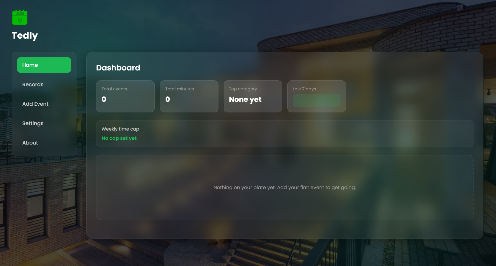

# Tedly - The Campus Planner



## Developer

**Teddy Ntawe**

GitHub: https://github.com/teddyntawe-ALU
Email: [t.ntawe@alustudent.com](mailto:t.ntawe@alustudent.com)
Github Pages 

## Overview

Tedly is a simple campus planner built to help students stay on top of their academic responsibilities. Students can use it to plan assignments, projects, quizzes, and study sessions in one place.

The main goal is to make school planning easier by showing what needs to be done, when it is due, and how much time it may take.

## Basic Wireframes

Desktop layout:

```text
Header / Logo
------------------------------------------------
Side Menu        Main Content Area
Home             Dashboard cards
Records          Records table
Add Event        Event form
Settings         Settings form
About            About text
```

Mobile layout:

```text
Logo + Menu Button
------------------------------------------------
Collapsible Menu
------------------------------------------------
Main Content Area
Dashboard cards / form / records cards
```

## Data Model

Each planner event will use this basic shape:

```js
{
  id: "sample-1",
  title: "Math Project",
  category: "Assignment",
  dueDate: "2026-07-01",
  duration: 90,
  notes: "Finish the project draft"
}
```

Settings will use this basic shape:

```js
{
  reminders: "on",
  reminderTime: "1day",
  weekStart: "monday",
  timeUnit: "minutes",
  weeklyCap: 600
}
```

## Accessibility Plan

- Use semantic page areas such as header, navigation, main content, sections, tables, forms, and buttons.
- Keep labels connected to form fields.
- Use ARIA live regions for validation, search, and cap status messages.
- Make the mobile menu keyboard accessible.
- Keep visible focus states for buttons and inputs.
- Check the app using keyboard-only navigation before the final submission.

## Features

### Dashboard

The dashboard will show total events, total minutes, top category, weekly activity, and weekly cap status.

### Event Management

Users will be able to add, edit, and delete planner events with title, category, due date, duration, and notes.

### Records

The records section will show saved events in a table on desktop and cards on mobile. It will support sorting and regex search.

### Settings

Users will be able to save preferences such as reminders, week start day, duration unit, and weekly time cap.

## Project Structure

```text
index.html
tests.html
seed.json
assets/
styles/
  style.css
scripts/
  app.js
  storage.js
  state.js
  ui.js
  validators.js
  search.js
```

## Milestone Checklist

- M1 - Spec and Wireframes: in progress/completed for first version
- M2 - Semantic HTML and Base CSS: in progress/completed for first version
- M3 - Forms and Regex Validation: planned
- M4 - Render, Sort, and Regex Search: planned
- M5 - Stats and Cap Targets: planned
- M6 - Persistence, Import/Export, and Settings: planned
- M7 - Polish and Accessibility Audit: planned

## Technologies Used

- HTML
- CSS
- JavaScript
- Local Storage

## Testing

The project includes `tests.html` as the page where validator and search tests will be added during the next phases.
